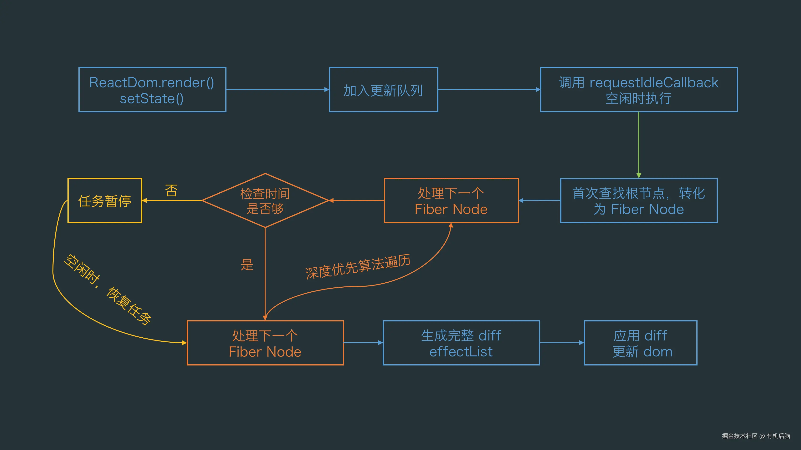
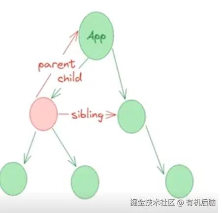

# 什么的 Fiber

Fiber 用于协调组件的渲染和生命周期，可以理解为是一个执行单元，也可以理解为是一种链表数据结构

## 引入 fiber 之前

虚拟 dom 就是一个对象，这个对象包含 dom 节点类型的 type，以及 dom 属性的 props 对象。
虚拟 dom 渲染到页面一共分为几个阶段:

- 创建 dom
- 加工属性
- 递归遍历子元素

```
const render = (element, container) => {
  // 创建dom节点
  let dom = document.createElement(element.type);
  // 添加属性
  const props = Object.keys(element.props);
  props.forEach((e) => {
    if (e !== "children") {
      dom[e] = element.props[e];
    }
  });
  // 处理子元素
  if (Array.isArray(element.props.children)) {
    // 是数组，那就继续递归
    element.props.children.forEach((c) => render(c, dom));
  } else {
    // 是文本节点就设置文本
    dom.innerHTML = element.props.children;
  }
  // 将当前加工好的dom节点添加到父容器节点中
  container.appendChild(dom);
};

render(vDom, document.getElementById("root"));

```

缺点：一旦该 dom 的结构非常复杂那么该递归的过程将会非常耗时，而且一旦该递归一开始那么将不能停止
浏览器的渲染主要是在主线程上执行，一旦主线程上有一个耗时的任务，那么就会导致页面的渲染不流畅，甚至出现卡顿的现象。
毕竟 js 引擎线程和 UI 渲染线程是互斥的

为了解决以上问题，react 团队在 react16 引入了一种全新的解决方案 fiber 架构

## 执行单元

可以把 fiber 理解成一个执行单元，每执行完一个执行单元，react 就会检查现在剩余多少时间，如果还有空闲时间则将时间控制权交出去，这个获取控制权的过程可以使用浏览器的 requestIdleCallback 方法实现
理解：
Fiber 架构就像是将一个大任务分解成一系列小任务的智能管家，每个小任务都是一个独立的单元，需要一口气完成，不能中途停下来。
一旦小任务完成了，Fiber 就会主动把控制权还给浏览器，让浏览器有机会去处理用户的新操作。
避免了像过往一样非得等到整个大任务全都执行完，浏览器才会响应用户的新动作。
简而言之，Fiber 通过细分任务，让浏览器在处理任务的同时，也能保持对用户操作的快速响应。



## 数据结构

Fiber 使用链表这种形式来组织。在这个结构中，每个虚拟 DOM 元素都对应一个 Fiber 节点，就像下面的图示那样，每个节点都代表一个 Fiber。每个 Fiber 节点都有指向它的孩子（child）、兄弟（sibling）和父母（parent）的指针。


- 在 fiber 中使用了 requestIdleCallback 方法来获取每一帧的空闲时间的控制权。相当于告诉浏览器我的这个任务优先级不高，如果每一帧内存在空闲时间，就可以执行注册的这个任务。
- requestAnimationFrame 在每一帧到来时执行相应的回调，确保浏览器在下一次重绘之前调用相应的回调函数来更新动画。
