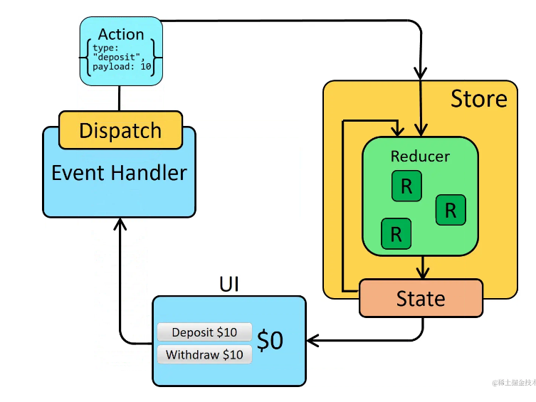
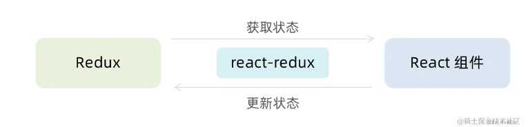
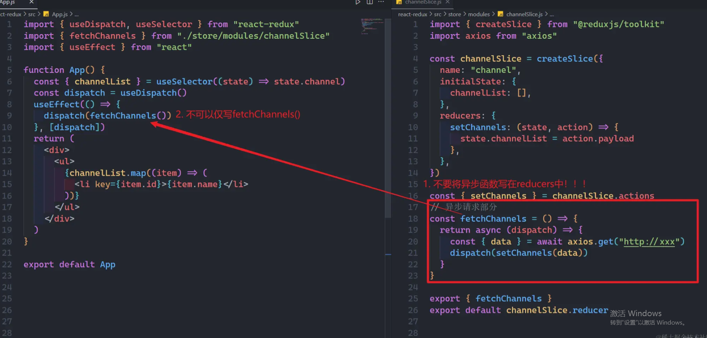

## Redux 的核心

> 单向数据流框架
> redux 的设计思想是将状态（state）和状态修改逻辑（reducer）分离，通过中央存储（store）来管理应用程序中的状态（state），使得应用程序的状态更加可预测和可控。
> redux 的核心概念是 action，reducer 和 store
>
> - action：表示应用程序中的一个事件或者操作，是一个 js 对象，包含一个 type 属性和一些其他的数据。
>   当触发某个事件时，会同 dispatch 触发一个 action，派发一个通知 Redux 中的状态需要改变
> - reducer：表示应用程序中的状态修改逻辑，纯函数，接收当前状态 state 和 action 对象作为参数，返回一个新的状态 state。
> - store：表示应用程序中的状态存储，js 对象，包含应用程序的当前状态 state 和一些操作状态的方法

Redux 的工作流程/基本原理

- 应用程序中的某个事件触发一个 action
- Redux 的 store 接收到 action，调用对应的 reducer 来修改应用程序的状态
- 修改后的状态重新被存储在 Redux 中 store 中，所有订阅 store 的组件都会收到通知并更新

在 React 中使用 redux，官方建议安装两个其他插件 - Redux Toolkit 和 React-Redux

- Redux Toolkit（RTK）：官方推荐编写 Redux 逻辑的方式，是一套工具的集合集，简化书写方式
- React-Redux ：用来 链接 Redux 和 React 组件的中间件
  > - React-Redux 是一个用于连接 React 组件和 Redux 状态管理的库，它提供了一些 React 组件和 Redux 之间的通信机制，使得 React 组件可以访问 Redux 中的状态和 dispatch 方法，从而实现数据的双向绑定和状态管理。
  > - UI 组件：负责呈现页面。（React）
  > - 容器组件：负责管理数据和业务逻辑。（Redux）

## Provider 组件

> Provider 是 React-Redux 中的一个**高阶组件**，它的作用是将 Redux 的 store 传递给整个 React 应用程序，使得所有的组件都能够访问到 Redux 的状态。通过 Provider，我们可以在 React 应用的任何地方使用 Redux 的状态和派发动作。

## Redux 异步 action 处理

> 服务器获取数据或执行一些异步任务。在 Redux 中处理异步操作通常需要使用中间件**Redux Thunk 中间件**来实现。
> 
