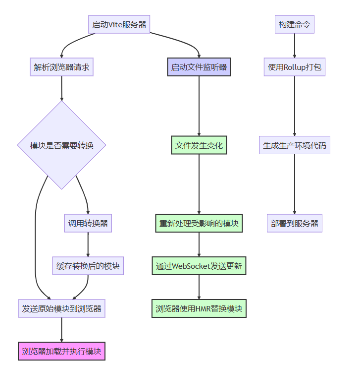

# vite

## vite 的原理

- 原生 ESM 基于现代浏览器对 ESM 的支持，将项目中的模块按照 ESM 的规范进行组织。
  在开发过程中，vite 只会处理被引用的模块，不会对整改项目进行打包
  vite 在处理模块时，通过识别 import 语句中的模块标识符，可以动态构建模块之前的依赖关系图。

### Vite 实现的核心流程

#### 启动服务器

Vite 首先启动一个开发服务器，该服务器使用原生 ESM（ECMAScript 模块）规范。
服务器同时创建一个 WebSocket 连接，用于实现与浏览器的实时通信。

#### 解析请求

- 当浏览器请求一个模块（例如，通过`<script type="module">`标签引入的 JavaScript 文件）时，Vite 服务器接收请求。
- 服务器解析请求，确定要加载的模块。

#### 模块转换

- 如果请求的模块需要转换（例如，使用 Vue 或 React 等框架编写的组件），Vite 会调用相应的插件或转换器进行处理。
- 转换后的模块被缓存起来，以便后续请求可以更快地提供服务。

#### 发送模块到浏览器

- Vite 服务器将处理后的模块作为 HTTP 响应发送给浏览器。
- 浏览器接收到模块后，按照 ESM 规范进行加载和执行。

#### 文件监听与热更新

- Vite 服务器使用文件系统监听器（如 chokidar）来监控项目文件的变化。
- 当文件发生变化时（例如，保存了一个源代码文件），Vite 会重新处理受影响的模块。
- 通过 WebSocket 连接，Vite 将更新后的模块发送给浏览器。
- 浏览器接收到更新后，使用 HMR（热模块替换）机制替换旧模块，无需重新加载整个页面。

#### 构建生产环境代码

- 当需要构建生产环境的代码时，Vite 会使用 Rollup 或其他打包工具进行打包。

- 打包过程会进行代码优化、压缩和分割等操作，以减小最终代码的体积并提高加载性能。

- 打包完成后，生成的生产环境代码可以部署到服务器上供用户访问。
  

在 **Vite** 中，相对路径的处理主要依赖于两种情况：**开发环境**和**构建环境**。Vite 作为现代前端构建工具，其对相对路径的处理方式与传统的 Webpack 或其他构建工具有所不同，主要体现在开发时的实时构建和静态资源路径的优化。

## vite 是如何处理相对路径？

### 1. **开发模式下的相对路径处理**

在开发模式下（即 `vite` 启动本地开发服务器时），Vite 会对资源请求进行一些特殊处理：

#### a. **资源路径解析**

在 Vite 的开发服务器中，相对路径的解析会基于你的项目的结构来处理。Vite 会尝试尽可能精确地解析这些路径，确保能够在开发环境中正确找到资源。

例如：

- 对于 `src="images/logo.png"`，如果它是相对路径，Vite 会尝试在 `public` 目录、`src` 目录等中查找该文件。
- 对于模块导入，如 `import 'styles/main.css'`，Vite 会根据项目结构去寻找相对路径的模块或资源。

#### b. **`public` 目录的特殊处理**

- 在 Vite 中，任何放在 `public` 目录下的文件都会被直接暴露到应用的根路径。比如，如果你在 `public` 目录下有一个 `logo.png`，那么它可以通过 `/logo.png` 进行访问。
- 这样，你在 HTML 文件或 JS 文件中使用相对路径引用公共文件时，实际上是访问的 `/` 根路径下的文件。

```bash
public/
  └── logo.png
```

如果在代码中使用：

```html

```

Vite 会把这个路径映射到 `public/logo.png`，并且在开发时通过 `/logo.png` 访问它。

### 2. **构建模式下的相对路径处理**

在生产构建时，Vite 会对相对路径进行一些优化，特别是对于静态资源（如图片、字体等）的引用。这些资源会被处理成经过哈希化的路径，从而确保资源可以被缓存且不会因为文件内容变化而导致缓存失效。

#### a. **静态资源的处理**

对于静态资源，Vite 会根据配置将它们复制到构建输出目录，并根据配置生成相对或绝对路径。

比如：

- 在开发时，路径可能是相对的，例如 `./assets/logo.png`。
- 在构建后，这些路径可能会变成类似 `./assets/logo.123abc.png`，其中 `123abc` 是资源的哈希值。

#### b. **`base` 配置项**

Vite 允许通过 `base` 配置项来指定构建输出时资源的公共基础路径。默认情况下，`base` 是 `'/'`，这意味着所有静态资源的路径都会是相对于根目录的。

你可以在 `vite.config.js` 中修改 `base` 配置项：

```javascript
// vite.config.js
export default {
  base: "/my-app/", // 设置公共基础路径
}
```

这会影响所有静态资源的路径，使它们相对于 `/my-app/` 路径来加载。

#### c. **相对路径与绝对路径**

在构建时，如果静态资源使用的是相对路径，它们通常会被重写为绝对路径。例如，如果你在 `src` 中引用一个相对路径的静态资源，Vite 会将其转换成一个绝对路径，以便正确地指向构建后的文件位置。

### 3. **具体的例子：如何在项目中使用相对路径**

#### a. **CSS 文件中引用的资源路径**

假设你有一个 CSS 文件 `styles/main.css`，里面有一个引用图像的相对路径：

```css
/* styles/main.css */
body {
  background-image: url("../images/background.png");
}
```

- 在开发模式下，Vite 会将 `url('../images/background.png')` 解析为相对于 CSS 文件的路径。
- 在生产模式下，Vite 会根据构建输出目录进行优化，可能会将路径改为一个带哈希值的路径，例如 `url('/assets/background.123abc.png')`。

#### b. **JavaScript 文件中动态引入图片或其他静态资源**

Vite 支持通过 `import` 语法动态加载静态资源。例如，在 `main.js` 中：

```javascript
import logo from "./assets/logo.png"

const img = document.createElement("img")
img.src = logo
document.body.appendChild(img)
```

- 在开发模式下，`logo` 会是一个相对路径，指向项目中的图片文件。
- 在生产模式下，Vite 会把 `logo.png` 处理成带哈希值的 URL，确保缓存有效性。

### 4. **相对路径 vs. 绝对路径**

- **相对路径**：在开发过程中，相对路径（如 `./assets/logo.png`）会被 Vite 处理成相对于当前文件的位置。它通常用于模块导入或者引用静态资源。
- **绝对路径**：当你将静态资源放置在 `public` 目录下时，Vite 会将其处理成根路径下的绝对路径（例如 `/logo.png`），并在构建过程中将其放到静态资源目录中，最终生成的 URL 也会是根路径下的。

### 5. **Vite 的路径优化**

- **路径重写**：Vite 在构建时会自动优化路径，例如重写静态资源的 URL，增加哈希值，确保浏览器能正确地缓存和访问这些资源。
- **HMR（Hot Module Replacement）**：在开发模式下，Vite 会实现热更新，确保在修改文件后浏览器能即时获取到更新的内容。

### 6. **总结**

- **开发模式下**，Vite 通过本地开发服务器和模块系统处理相对路径，确保开发中的资源能够被正确加载。`public` 目录中的资源会暴露为根路径。
- **构建模式下**，Vite 会优化路径，通常会将静态资源的路径转化为带哈希值的 URL，并确保缓存和性能的优化。
- 你可以通过修改 `vite.config.js` 中的 `base` 配置来调整资源路径的根目录，适应不同的部署环境。

Vite 的路径处理方式非常灵活，能够有效解决开发和生产环境中相对路径和静态资源的管理问题，确保应用的稳定运行。
