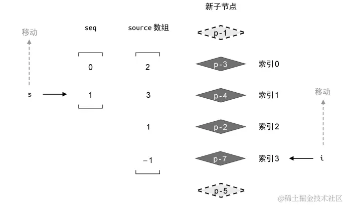

# 【源码系列#06】Vue3 Diff 算法 🌸

[https://www.douyin.com/search/%E5%93%B2%E7%8E%84%E5%89%8D%E7%AB%AF?modal_id=7258902157800246589&type=video]

## 前后元素不一致

- 两个不同虚拟节点不需要进行比较，直接移除老的节点，然后将新的节点渲染成真实的 dom 挂载到页面上

## 前后元素一致

- 两个相同的虚拟节点，先复用节点，再比较两个节点的属性和子节点
  - 能复用就复用
  - 然后再新增或者删除
- 判断是否是相同的虚拟节点？
  - 判断节点的 key 是否相同
  - 判断节点的 type 是否相同

## 核心 Diff 算法

### 在处理有 key 进行 diff 算法时，我把对比分为四种情况需要处理：

- 从前往后递增对比节点类型和 key 相同的进行复用（在不同处停止对比）。
- 从后往前递减行对比节点类型和 key 相同的进行复用（在不同处停止对比）。
- 新子级比旧子级多，说明有新增节点，如果少说明要卸载某些旧节点。
- 首尾相同都可能会有相同节点，首尾都对比完，中间部分可能存在可复用乱序节点。

前序比对、后序比对、同序列加挂载、同序列加卸载的目的都是：尽可能减少后面乱序比对的元素 在正式介绍 diff 算法之前，我们先了解几个问题

如何判断是否是相同的虚拟节点？
答：虚拟节点的 type 类型相同 && key 相同 即可

c1、c2 指的是什么？
答：patch 对比元素打补丁，先复用节点、再比较属性、最后比较儿子节点。c1 指的是旧的儿子节点；c2 指的是新的儿子节点

e1、e2 指的是什么？
答：尾指针，初始值分别指向新旧孩子的最后一个节点，e1 = c1.length - 1 ；e2 = c2.length - 1

- sync from start 前序对比
  从头部开始正序比对，如果是相同的虚拟节点，则调用 patch 对比元素打补丁（先复用节点、再比较属性、再递归比较子节点），i++继续；
  终止条件：新旧虚拟节点不一致，或 双方有一方 i 大于 尾指针，停止循环(i > e1 && i > e2)
  ```
    while (i <= e1 && i <= e2) {  //从头开始比，相同就进行patch，有一方停止循环直接跳出
      const n1 = oldChildren[i]//取出每一个进行比较是否相同
      const n2 = newChildren[i]
      if (isSameVnode(n1, n2)) {//比较类型和key，如果相同就递归比较他们的子级
        //对比两个元素（上面只是类型和key相同，并不代表两个元素中属性或子级相同）
        patch(n1, n2, el)
      } else {
        //当两个元素不相同时就停止比较，因为要更新当前的旧元素
        break
      }
      i++
    }
  ```
- sync from end 后序对比
  从尾部开始倒序比对，如果是相同的虚拟节点，则调用 patch 对比元素打补丁（先复用节点、再比较属性、再递归比较子节点），e1-- e2-- 继续；
  终止条件：新旧虚拟节点不一致，或 双方有一方 i 小于 头指针，停止循环(i < e1 && i < e2)
  ```
   while (i <= e1 && i <= e2) {//再从后往前比
    const n1 = oldChildren[e1]//取出最后一个
    const n2 = newChildren[e2]
    if (isSameVnode(n1, n2)) {//比较类型和key，如果相同就递归比较他们的子级
      patch(n1, n2, el)
    } else {
      //当两个元素不相同时就停止比较，因为要更新当前的旧元素
      break
    }
    e1--
    e2--
  }
  ```
- common sequence+mount 同序列加挂载
  分为 头部挂载 和 尾部挂载 两种场景
  i 比 e1 大说明有要新增的，i 和 e2 之间的是新增的节点

  ```
    // common sequence + mount 同序列加挂载
    // i要比e1大说明有新增的；i和e2之间的是新增的部分
    // (a b c)
    // (a b c) d e
    //     (a b c)
    // e d (a b c)
    if (i > e1) {
      if (i <= e2) {
        while (i <= e2) {
          const nextPos = e2 + 1
          // 根据下一个人的索引来看参照物
          const anchor = nextPos < c2.length ? c2[nextPos].el : null
          patch(null, c2[i], container, anchor) // 创建新节点 扔到容器中
          i++
        }
      }
    }

  ```

- common sequence+unmount 同序列加卸载
  分为 头部卸载 和 尾部卸载 两种场景
  i 比 e2 大说明有要卸载的，i 到 e1 之间的就是要卸载的节点

  ```
    // common sequence + unmount 同序列加卸载
    // i比e2大说明有要卸载的；i到e1之间的就是要卸载的
    // (a b c) d e
    // (a b c)
    // e d (a b c)
    //     (a b c)
    else if (i > e2) {
      if (i <= e1) {
        while (i <= e1) {
          unmount(c1[i])
          i++
        }
      }
    }
  ```

  前序比对、后序比对、同序列加挂载、同序列加卸载的目的都是：尽可能减少后面乱序比对的元素

- unknown sequence 乱序对比
  前后对比完后，中间就剩乱序的子级，要在当中找出哪些可以复用，不能复用就要删除掉，新增的子级就创建元素并插入

  ```
    (a b) c d e   (f g)
    (a b) e c d h (f g)
    从上图可看出CDE都可进行复用，只需要对h进行新增；
    下面会把旧子级中[C,D,E]称为旧乱序子级（列表），新子级中[E,C,D,H]称为新乱序子级（列表）
  ```

  - 思路：
    - 新增 s1 和 s2 指针，分别指向在 i 停止的位置
    - 把新子级的所有乱序元素（ECDH）保存在一个映射表里（keyToNewIndexMap）[{'E' : 2}, {'C': 3},{ 'D' : 4}, {'H' : 5}]
    - 遍历旧乱序子级，查找映射表中是否存在该元素，存在就进行复用，不存在就说明需要创建新元素并插入，还要把旧节点进行删除
    - 新增 toBePatched 属性保存新乱序子级的个数，进行倒叙插入（找出当前元素的下一个元素节点作为参照物插到其前面，如果没有直接插入最后面即可）
    - 新增 newIndexToOldIndexMap 属性，以 toBePatched 为长度的数组，并设置默认值为 0，[0,0,0,0]，对旧乱序子级循环查找可复用节点中，如果存在就会进行 patch 的同时并进行标识，可以理解为对 patch 过的新虚拟 DOM 进行标识（因为可以复用旧虚拟 DOM 保存好的真实节点），在进行移动位置时就可以判断，如果还是为 0 的就是需要创建真实节点的
  - 代码：

  ```
    //-----乱序比对-----
    //以下要判断无序的可以复用情况 如i到e1和到e2之间的都称为乱序
    let s1 = i
    let s2 = i
    const keyToNewIndexMap = new Map()//用于保存乱序的新子级中的元素的下标
    for (let i = s2; i <= e2; i++) {//注意i是从s2开始
      keyToNewIndexMap.set(newChildren[i].key, i)
    }
    //console.log(keyToNewIndexMap);//[{'E' : 2}, {'C': 3},{ 'D' : 4}, {'H' : 5}]

    //循环乱序旧子级，看看新子级存不存在该元素，存在就添加到列表中复用，否则删除
    const toBePatched = e2 - s2 + 1 //新乱序总个数
    //根据乱序个数创建数组并赋值为0，记录是否比对过映射表
    const newIndexToOldIndexMap = new Array(toBePatched).fill(0)//[0,0,0,0]
    for (let i = s1; i <= e1; i++) {//循环旧乱序子级
      const oldchild = oldChildren[i]//根据下标获取到旧乱序中的元素
      //查找是否存在该元素，里面保存的是对应元素在newChildren的下标
      let newIndex = keyToNewIndexMap.get(oldchild.key)
      if (newIndex == undefined) {
        unmount(oldchild)//多余的删掉
      } else {
        newIndexToOldIndexMap[newIndex - s2] = i + 1 //标识
        patch(oldchild, newChildren[newIndex], el)//如果存在就比对子级差异
      }

    }//到这只是新旧比对，没有移动位置

    //console.log(keyToNewIndexMap);//[{'E' : 2}, {'C': 3},{ 'D' : 4}, {'H' : 5}]
    //console.log(newIndexToOldIndexMap);//[5, 3, 4, 0]

    //需要移动位置
    for (let i = toBePatched - 1; i >= 0; i--) {//倒叙插入
      let index = i + s2 //找到当前元素在newChildren中的下标
      let current = newChildren[index] //找到newChildren最后一个乱序元素
      //找到元素的下个元素作为参照物
      let anchor = index + 1 < newChildren.length ? newChildren[index + 1] : null
      //current可能是新增的元素没有el，如果没有el
      if (newIndexToOldIndexMap[i] === 0) {
        patch(null, current, el, anchor)//第一个元素传入null，表示要创建元素并根据参照物插入
      } else {
        hostInsert(current.el, el, anchor.el)//存在el直接根据参照物插入
      }
    }
  ```

  ```
    优化的办法是先遍历新的一组子节点，根据子节点的位置和 key 生成一张索引表，然后再遍历旧的一组子节点，利用节点的 key 在索引表中找到对应的新子节点的位置，以此填充 source 数组。
    const oldStart = j
    const newStart = j
    const keyIndex = {}
    for(let i = newStart; i <= newEnd; i++) {
        keyIndex[newChildren[i].key] = i
    }
    for(let i = oldStart; i <= oldEnd; i++) {
      oldVNode = oldChildren[i]
      const k = keyIndex[oldVNode.key]
      if (typeof k !== 'undefined') {
        newVNode = newChildren[k]
        patch(oldVNode, newVNode, container)
        source[k - newStart] = i
      } else {
        unmount(oldVNode)
      }
    }
    首先将预处理之后的j值作为遍历新旧节点开始时的索引，定义一个对象keyIndex作为索引表，遍历预处理之后剩余的一组新子节点，将新子节点newChildren[i]的key值与其位置索引放入索引表中。
    遍历旧子节点，在遍历时，我们可以通过当前节点的key去keyIndex索引表中获取从而拿到当前遍历的旧子节点的oldChildren[i]对应的新节点的位置keyIndex[oldVNode.key],如果位置存在，说明节点可复用，使用patch打补丁，并且使用当前旧节点的索引i对source数组进行填充。
  ```

  经过上述一番乱序对比之后，要倒序遍历新的乱序节点，对每个节点都进行操作，会有点儿浪费性能，能不能尽可能少的移动节点位置，有保证节点顺序正确呢？
  例如旧节点 1, 3, 4, 2，新节点 1, 2, 3, 4。那我们完全可以只将 2 移动到 3 前面，只需移动一次！就能保证顺序是正确的！！！
  我们可以针对于乱序比对中生成的数组 newIndexToOldIndexMap 获取最长递增子序列
  最长递增子序列的意义：通过最长递增子序列得到的索引可以提示我们哪些元素的相对位置，在子节点更新后并未发生变化，我们可以保留这些节点的相对位置，然后去处理和移动其他位置。



```
  根据最长递增子序列移动节点：
  创建两个索引辅助移动:
  索引 i 指向新的一组子节点中的最后一个节点。
  索引 s 指向最长递增子序列中的最后一个元素。
  我们需要去判断以下的情况:
    source[i] === -1: 节点不存在，需要挂载新节点
    i!==seq[s]：节点需要移动，
    i===seq[s]：节点无需移动，将s递减并再次进行比较
    完善patchKeyedChildren去处理这几种情况:
    function patchKeyedChildren(n1, n2, container) {
      //省略预处理和构造source数组代码
      if (moved) {
        const seq = lis(source)
        // s 指向最长递增子序列的最后一个值
        let s = seq.length - 1
        let i = count - 1
        for (i; i >= 0; i--) {
          if (source[i] === -1) {
            // 说明索引为 i 的节点是全新的节点，应该将其挂载
            // 该节点在新的一组子节点中的真实位置索引
                const pos = i + newStart
                const newVNode = newChildren[pos]
                // 该节点下一个节点的位置索引
                const nextPos = pos + 1
                // 锚点
                const anchor = nextPos < newChildren.length
                  ? newChildren[nextPos].el
                  : null
                patch(null, newVNode, container, anchor)
          } else if (i !== seq[j]) {

            // 说明该节点需要移动
            // 该节点在新的一组子节点中的真实位置索引
            const pos = i + newStart
            const newVNode = newChildren[pos]
            // 该节点下一个节点的位置索引
            const nextPos = pos + 1
            // 锚点
            const anchor = nextPos < newChildren.length
              ? newChildren[nextPos].el
              : null
            patch(null, newVNode, container, anchor)
          } else {
            // 当 i === seq[j] 时，说明该位置的节点不需要移动
            // 并让 s 指向下一个位置
            s--
          }
        }
      }
    }
    }


```

```
官方：
  如果不使用key，Vue会使用一种最大限度减少动态元素并且尽可能的尝试就地修改/复用相同类型元素的算法;
  （意思应该是：比如两个li元素，只是内容不同，尝试修改内容后复用该节点；因为新子级的虚拟DOM中是没有保存真实el节点的，需要根据标签名创建元素节点再进行挂载）
  而使用key时，它会基于key的变化重新排列元素顺序，并且会移除/销毁key不存在的元素;
```
