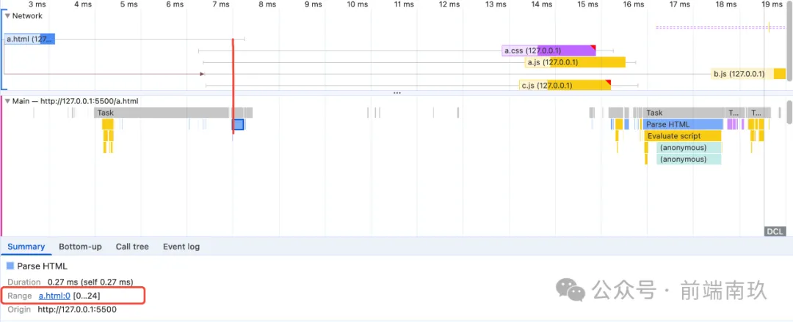

## 认识 DOM

DOM 把整个页面映射为一个多层的节点结构，HTML 或 XML 页面中的每个组成部分都是某种类型的节点，这些节点又包含着不同类型的数据。

### 为什么需要生成 DOM 树？

- 结构化数据：将 HTML 标签（如<div>、<p>）和文本内容转化为节点对象，以树形结构表示标签的父子嵌套关系。
- js 动态操作节点，解决了原生 html 文本的局限性，允许 js 通过属性和方法直接操作节点。
- 渲染过程的核心输入，dom 树提供了页面的结构信息，cssom 树提供了页面的样式信息，最终结合二者生成渲染树，决定页面的布局和样式以及元素的可见性。
- 安全性：dom 解析过程中，浏览器会对输入的 HTML 进行过滤和验证，防止恶意脚本注入和跨站脚本攻击。
  ** DOM 是浏览器对页面的内部表示，也是 Web 开发人员可以通过 JS 交互的数据结构和 API **

## 解析 HTML

网络线程获取 HTML 文件后，浏览器才会开始解析 HTML，解析过程分为以下几个步骤：

每个 html 标签都会被浏览器解析成文档对象，并且所有的文档对象最终会被挂在 document 对象上，并且为了提高解析效率，在解析前，浏览器会启动一个预解析的线程，提前去下载文档中的外部资源，比如 css、js、图片等。

1. 分词/词法分析：将 HTML 代码转换为一个个的 Token（标记）。
2. 生成 DOM 树：将 Token 转换为 DOM 节点，并构建 DOM 树。
3. 生成 CSSOM 树：将 CSS 代码转换为 CSSOM 节点，并构建 CSSOM 树。
4. 生成渲染树：将 DOM 树和 CSSOM 树合并，生成渲染树。
5. 布局：计算渲染树中每个节点的位置和大小。
6. 绘制：将渲染树中的每个节点绘制到屏幕上。

## 解析 CSS

CSS 并不会阻塞 html 的解析，因为下载和解析 CSS 的工作是在预解析线程中进行的，
解析 html 的目的是为了生成 DOM 树，而解析 CSS 的目的同样是为了生成 CSSOM 树，两者都是为了转换成浏览器能够理解的结构，也可以方便 javascript 的访问。
CSSOM 结构主要是为了给 JavaScript 提供操作样式表的能力，以及提供基础的样式信息。

### CSS 是否会阻塞 HTML 解析？是否阻塞页面渲染？

虽然 CSS 并不会阻塞 html 的解析，但由于渲染树的生成需要 CSSOM 的参与，所以 CSS 是会阻塞页面渲染的
原因是，如果浏览器在 CSS 检查之前展示了页面，那么每个页面都是没有样式的，等一会之后又突然有了样式，整个页面的体验就会很差。由于 CSSOM 被用作创建渲染树，那么如果不能高效的利用 CSS 会导致白屏时间的增加

## 解析 javascript

### JavaScript 是否会阻塞 HTML 解析？

会。在构建 DOM 的过程中，如果遇到 script，在默认情况下主线程会停止对 html 的解析，转而等待 JS 文件下载好，并将全局代码解析执行完成后，才会继续解析 html。这是因为 **JS 代码的执行过程可能会修改当前的 DOM 树**，所以 DOM 树的生成必须暂停。


- 在默认情况下，script 标签在请求和执行的时候都会阻塞文档解析，这是因为 script 标签的默认行为是同步执行，即浏览器会等待 script 标签中的代码执行完毕后，才会继续解析文档。
- defer
  - 延迟脚本执行：当浏览器遇到 defer 脚本时，它会继续解析文档，同时会将脚本的下载和执行任务交给浏览器的其他线程来处理。当整个文档完成解析后，在触发 DOMContentLoaded 事件之前执行这些脚本。
  - 顺序执行：带有 defer 属性的脚本，尽管是异步加载的，但是它们之间会保持顺序执行。
- async
  - 异步脚本执行：当浏览器遇到 async 脚本时，它会继续解析文档，同时会将脚本的下载和执行任务交给浏览器的其他线程来处理。当脚本下载完成后，会立即执行，此时如果 HTML 还没有解析完成，则会暂停对 html 的解析，从而阻塞页面渲染。但如果当脚本加载完准备执行之前，html 已经解析完成，此时也不会阻塞页面渲染。
  - 无序执行：带有 async 属性的脚本，它们之间的执行顺序是不确定的，因为它们是异步加载的。
- module
  - 非阻塞加载：带有 type="module"的脚本加载是异步的，这类标签视为 ES6 模块来处理，不会阻塞文档解析和渲染工作，当 HTML 文档被解析完成后，会在触发 DOMContentLoaded 事件之前执行这些脚本。
  - 模块作用域：每个模块都有自己的作用域，模块内部的变量和函数只能在模块内部访问，不会污染全局作用域。
  - 支持静态导入和动态导入：可以使用 import 语句静态地导入其它模块，这些导入的模块加载时自动解析和执行。还可以使用 import()函数动态地导入模块，根据需要在运行时加载模块，进一步控制模块的加载和执行时机。

#### 如何通过 performance 面板验证以上观点

### JavaScript 的异步加载机制如何影响解析过程？

```
<!DOCTYPE html>
<html lang="en">
<head>
    <meta charset="UTF-8">
    <meta name="viewport" content="width=device-width, initial-scale=1.0">
    <title>Document</title>
    <link rel="stylesheet" href="./a.css" />
    <script>
        console.log('【readystatechange】', document.readyState)
        document.addEventListener('readystatechange', (e) => {
            console.log('【readystatechange】', document.readyState)
        })
        window.addEventListener('load', (e) => {
            console.log('【load】')
        })

        document.addEventListener('DOMContentLoaded', (e) => {
            console.log('【DOMContentLoaded】')
        })
    </script>
    <script defer src="./a.js"></script>
    <script async src="./b.js"></script>
    <script src="./c.js"></script>
</head>
<body>
    <div class="container"></div>
</body>
</html>
```


首先肯定是先加载 html 文件，而 html 中的 css 与 js 资源会以他们在文档中的顺序依次进行请求加载，由于内联脚本无需再发起请求，所以在网络模块中也不会有它的存在。

注意看红线位置，这是 html 开始解析的时间点，从 network 模块上看，内部的 css 与 js 资源竟然在这之前就发起了请求，这也就验证了为了加速，浏览器的预加载扫描器会同时运行，如果在 html 中存在 <link>、<script>、img 等标签，预加载扫描器会把这些请求传递给浏览器进程中的网络线程进行相关资源的下载。

从图中我们可以看到，a.css 与 c.js 文件右上角都出现了红色标注，这是代表这两个文件都会阻塞页面的渲染
可以看到 html 的解析、css 的解析、脚本的执行、页面渲染等都发生在主线程

在浏览器渲染引擎内部，有一个叫 HTML 解析器（HTMLParser）的模块，它负责将 HTML 字节流转换为 DOM 结构。HTML Standard 规范定义了浏览器渲染 HTML 为 DOM 的方法。

⚠️ 需要注意的是 HTML 解析器并不是等整个文档加载完成之后再解析的，而是网络进程加载了多少数据，HTML 解析器就解析多少数据。

注意看，第一次解析 html 的范围是 0-24，解析过程遇到了 css 资源，等 css 资源下载完成后会开始解析 css（这个过程不会阻塞 html 的解析）

parse stylesheet

Evaluate script
再往后就遇到了内联脚本，这个时候会停下来解析执行 JS（这才是导致 html 解析暂停的根本原因）

等脚本执行完后会继续解析 html

注意 range，跟上一次 parse html 刚好接上了

接着往后会依次遇到 a、b、c 三个脚本，由于 c 没有添加任何异步属性，所以 c 会率先开始执行（此时会阻塞 html 的解析）

执行完成后会继续解析 html

等解析完成后会开始执行标记了 defer 的 a.js（a.js 在这之前就已加载完成）

最后标记了 async 的 b.js 加载完成，会立即执行

### 如何通过 performance 面板验证以上观点

(https://mp.weixin.qq.com/s/2cW6Vx-m3WVaNckHzyvfVw)
